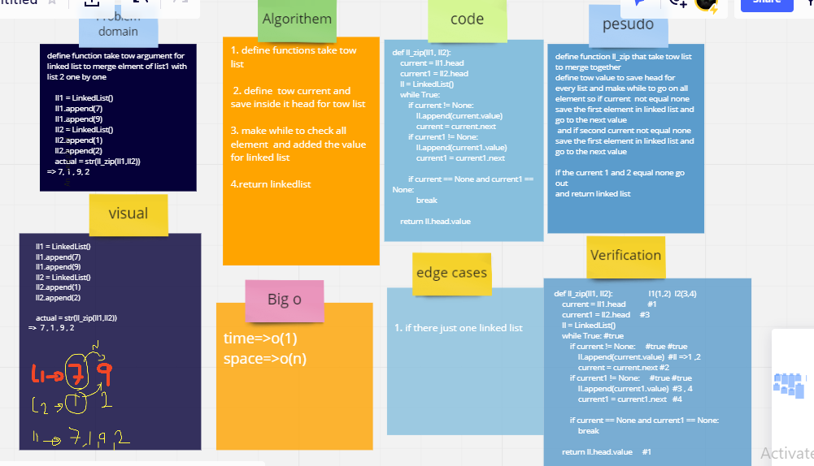

## Whiteboard Process

## Approach & Efficiency
creating a new list and taking the items from another lists then returning anew list O(n)
## Solution
i run it by test this method 

   ll1 = LinkedList()
    ll1.append(7)
    ll1.append(9)
    ll2 = LinkedList()
    ll2.append(1)
 ll2.append(2)

    actual = str(ll_zip(ll1,ll2))
=>  7 , 1 , 9 , 2
