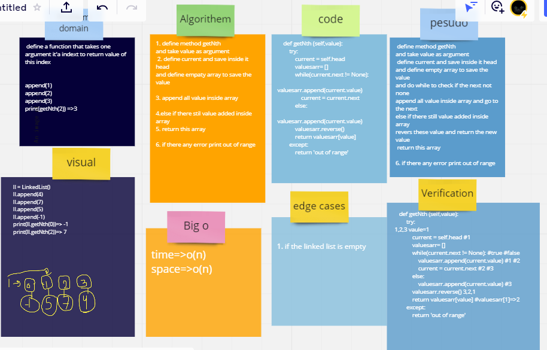

## Whiteboard Process

## Approach & Efficiency
the big o for  function  getNth  for time is O(n) and  space O(n)

## Solution
i run it by test this method 

ll=linkedlist
ll.append(1)
ll.append(2)
ll.append(3)
ll.getNth(2) output=>1
ll.getNth(0) output=>3

