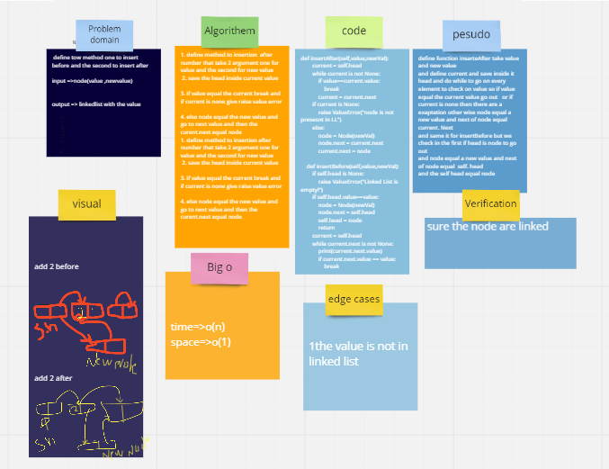

## Whiteboard Process

## Approach & Efficiency
the big o for insertion before and after for time is O(n) space O(1)

## Solution
i run it by test this tow method 
ll=linkedlist
ll.append(1)
ll.append(2)
ll.append(3)
ll.insetafter(2,5)
1 -2 -5-3

ll=linkedlist
ll.append(1)
ll.append(2)
ll.append(3)
ll.insetbefor(2,5)
1 -5 -2-3