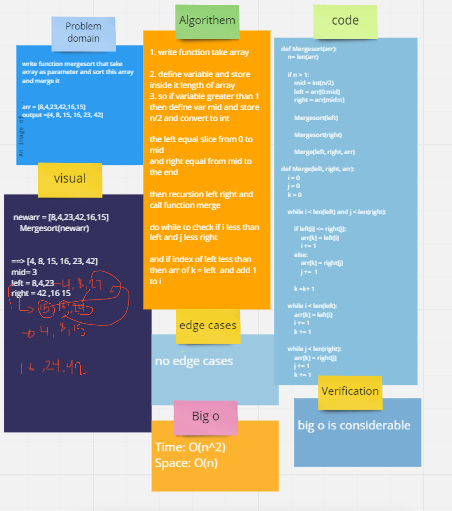

# Challenge Summary
write function mergesort that take array as parameter and sort this array and merge it


## Whiteboard Process


## Approach & Efficiency

* Time: O(n^2)
* Space: O(n)

## Solution


```
def Mergesort(arr):
    n= len(arr)

    if n > 1:
        mid = int(n/2)
        left = arr[0:mid]
        right = arr[mid:n]
      
        Mergesort(left)
        
        Mergesort(right)
        
        Merge(left, right, arr)

def Merge(left, right, arr):
    i = 0
    j = 0
    k = 0

    while i < len(left) and j < len(right):
        
        if left[i] <= right[j]:
            arr[k] = left[i]
            i += 1
        else:
            arr[k] = right[j]
            j +=  1
            
        k =k + 1

    while i < len(left):
        arr[k] = left[i]
        i += 1
        k += 1
    
    while j < len(right):
        arr[k] = right[j]
        j += 1
        k += 1
```

