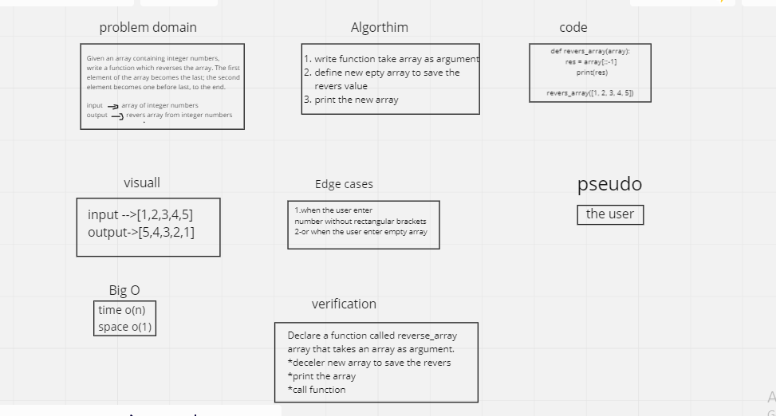

# Revers array
Write a function called reverseArray which takes an array as an argument. Without utilizing any of the built-in methods available to your language, return an array with elements in reversed order.

# Whitebord procees

# Approach and efficient
    this way it the most efficient way to reverse  array and it faster 
