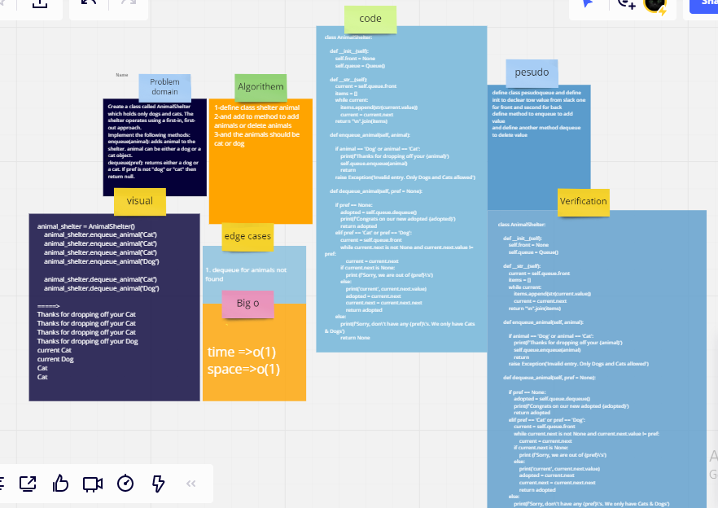

# Challenge Summary
Create a class called AnimalShelter which holds only dogs and cats. The shelter operates using a first-in, first-out approach.
Implement the following methods:
enqueue(animal): adds animal to the shelter. animal can be either a dog or a cat object.
dequeue(pref): returns either a dog or a cat. If pref is not "dog" or "cat" then return null.

## Whiteboard Process

## Approach & Efficiency
use queue to enqueue animals and dequeue animals time o(1) space o(1)

## Solution
shelter.enqueue_animal('Dog')
  shelter.enqueue_animal('Cat')
  shelter.enqueue_animal('Dog')
  shelter.enqueue_animal('Dog')
  shelter.enqueue_animal('Cat')

  shelter.dequeue_animal('Cat')
  assert shelter.__str__() == "Dog\nDog\nDog\nCat"
  ====>
  Thanks for dropping off your Cat
Thanks for dropping off your Cat
Thanks for dropping off your Cat
Thanks for dropping off your Dog
current Cat
current Dog
Cat
Cat
