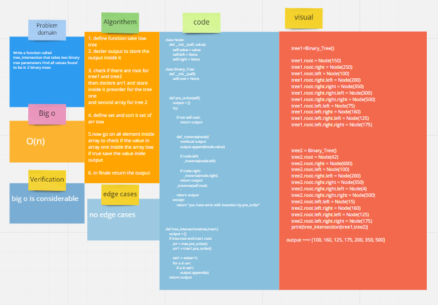

# Challenge Summary


Write a function called tree_intersection that takes two binary tree parameters Find all values found to be in 2 binary trees


## Whiteboard Process


## Approach & Efficiency
Bigo==> O(n)

## Solution

```
def tree_intersection(tree,tree1):
    output = []
    if tree.root and tree1.root:
        arr = tree.pre_order()
        arr1 = tree1.pre_order()

        set1 = set(arr1)
        for a in arr:
            if a in set1:
                output.append(a)
    return output 

```
