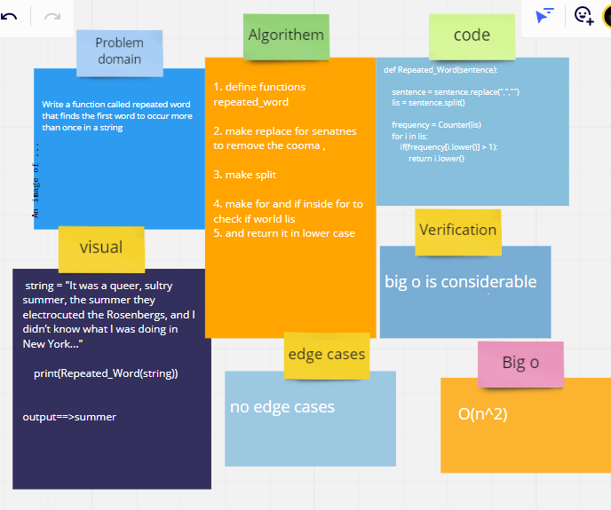

# Challenge Summary
Write a function called repeated word that finds the first word to occur more than once in a string

## Whiteboard Process



## Approach & Efficiency
big o ==> O(n^2)

## Solution

```
def Repeated_Word(sentence):

    sentence = sentence.replace(",","")
    lis = sentence.split()
  
    frequency = Counter(lis)
    for i in lis:
        if(frequency[i.lower()] > 1):
            return i.lower()
    
```