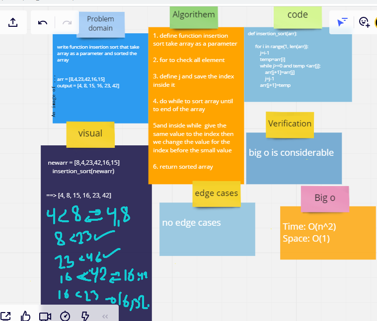

# Challenge Summary
write function insertion sort that take array as a parameter and sorted the array

## Whiteboard Process

## Approach & Efficiency
* Time: O(n^2)
* Space: O(1)

## Solution
 newarr = [8,4,23,42,16,15]
    insertion_sort(newarr) 
output => [4, 8, 15, 16, 23, 42]