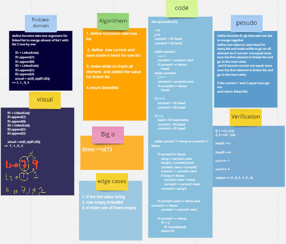

# Challenge Summary
write  function take tow argument for linked list to merge elment of list1 with list 2 one by one

## Whiteboard Process

## Approach & Efficiency
big o of time is O(1)

## Solution
    ll1 = LinkedList()
    ll1.append(7)
    ll1.append(9)
    ll2 = LinkedList()
    ll2.append(1)
    ll2.append(2)

    actual = str(ll_zip(ll1,ll2))
=>  7 , 1 , 9 , 2
