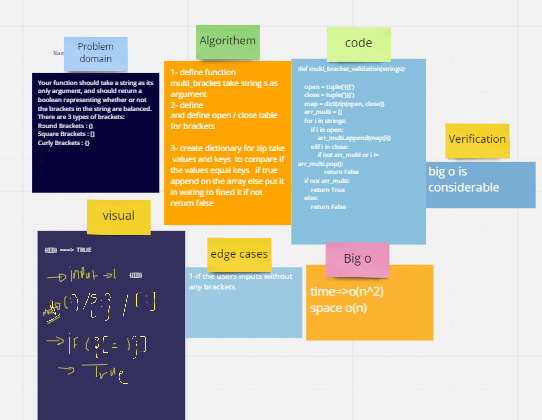

# Challenge Summary

The function should take a string only argument and should return a boolean representing whether or not the brackets in the string are balanced.

## Whiteboard Process
  
## Approach & Efficiency
  * Big O =>
     -  time => O(1)
     -  space => O(1)

I used empty array and an object with this details { '(':')', '[':']', '{':'}' }
I used a for loop if the number equal ( or [ then append it to the empty array or pop the array and return a false
if length of the array not equal to zero ===> return a false

## Solution

1.    print(multi_bracket_validation('(){}'))  ==================================> True
2.    print(multi_bracket_validation('()[[Extra Characters]]')) ===============> True
3.    print(multi_bracket_validation('({()}')) ===============> False
4.    print(multi_bracket_validation('({()})')) ===============> True
5.    print(multi_bracket_validation('({())))')) ===============> False
6.    print(multi_bracket_validation('([{()}])')) ===============> True
7.    print(multi_bracket_validation('({()})')) ===============> True
     

