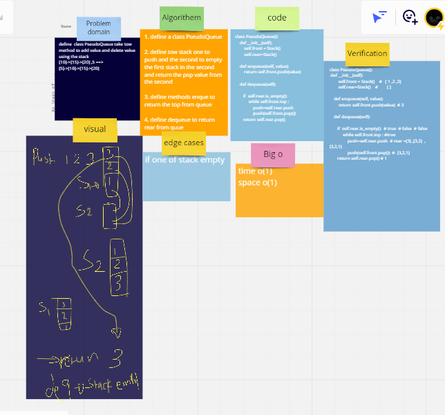

# Challenge Summary

define  class PseudoQueue take tow method to add value and delete value  using the stack

## Whiteboard Process

## Approach & Efficiency
o(1)

## Solution
   pseudo = PseudoQueue()
   * pseudo.enqueue(1)
   * pseudo.enqueue(2)
   * pseudo.enqueue(3)
   * pseudo.enqueue(4)
   * print(pseudo.front.top.value) =>4
   * print(pseudo.dequeue()) =>stack is empty 
   * print(pseudo.front.top.value) =>4
   * print(pseudo.dequeue()) =>2