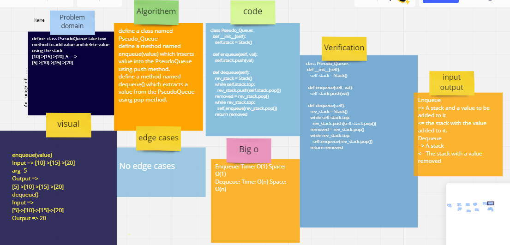

# Challenge Summary

define class to add and delete using stack
## Whiteboard Process

## Approach & Efficiency
o(1)

## Solution
   pseudo = PseudoQueue()
    pseudo.enqueue(1)
    pseudo.enqueue(2)
    pseudo.enqueue(3)
    pseudo.enqueue(4)
    print(pseudo.front.top.value) =>4
    print(pseudo.dequeue()) =>4

