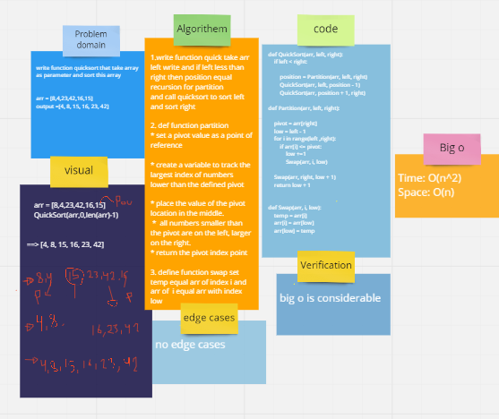
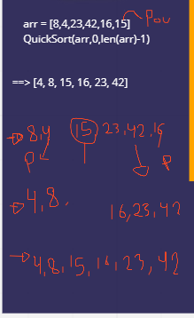

# Challenge Summary

write function quicksort that take array as parameter and sort this array

* arr = [8,4,23,42,16,15]
* output =[4, 8, 15, 16, 23, 42]
## Whiteboard Process

## Approach & Efficiency
* Time: O(n^2)
* Space: O(n)

## Solution

* arr = [8,4,23,42,16,15]
* QuickSort(arr,0,len(arr)-1)
* ==> [4, 8, 15, 16, 23, 42]

