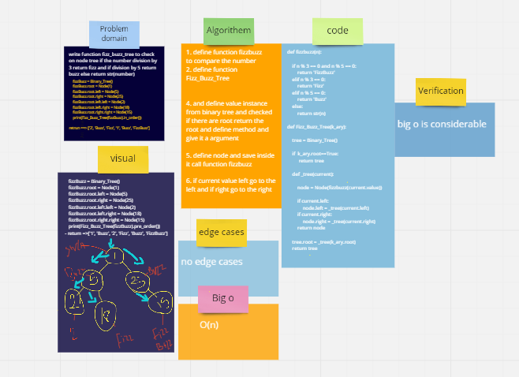
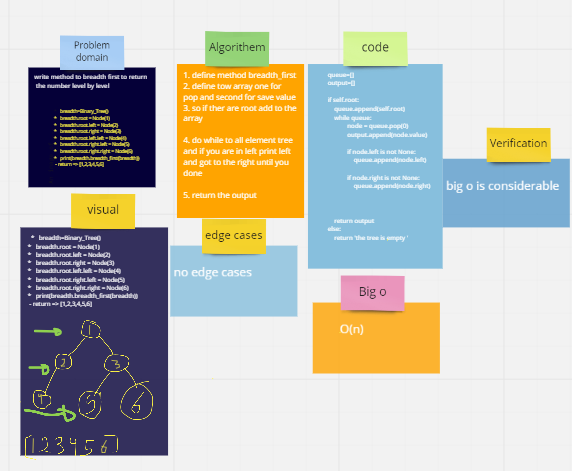
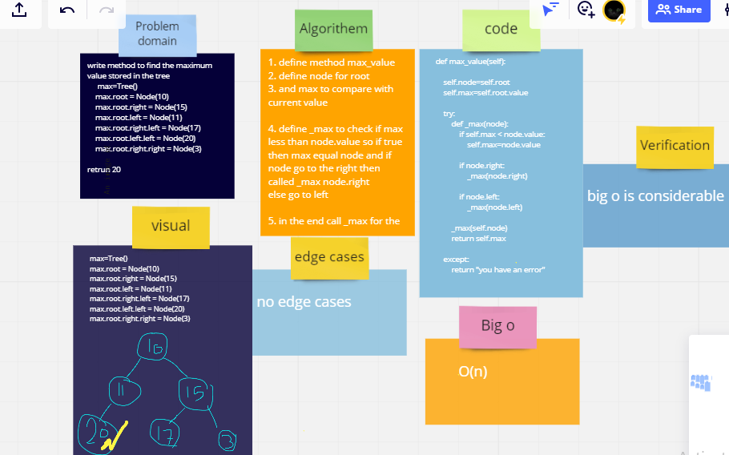

<!-- ////////////////////////////////////code challenge 18 ////////////////////////////////////////////// -->

 # Challenge Summary

write function fizz_buzz_tree to check on node tree if the number division by 3 return fizz and if division by 5 return buzz else return str(number)
    

## Whiteboard Process

## Approach & Efficiency
big(o) => o(n)

## Solution

*   fizzBuzz = Binary_Tree()
*   fizzBuzz.root = Node(1)
*   fizzBuzz.root.left = Node(5)
*    fizzBuzz.root.right = Node(25)
*   fizzBuzz.root.left.left = Node(2)
*   fizzBuzz.root.left.right = Node(18)
*   fizzBuzz.root.right.right = Node(15)
*   print(Fizz_Buzz_Tree(fizzBuzz).pre_order())
*  return => ['1', 'Buzz', '2', 'Fizz', 'Buzz', 'FizzBuzz']

<!-- ////////////////////////////////////code challenge 17////////////////////////////////////////////// -->

 # Challenge Summary
write method to breadth first to return  the number level by level
    

## Whiteboard Process

## Approach & Efficiency
big(o) => o(n)

## Solution

*   breadth=Binary_Tree()
*   breadth.root = Node(1)
*   breadth.root.left = Node(2)
*   breadth.root.right = Node(3)
*   breadth.root.left.left = Node(4)
*   breadth.root.right.left = Node(5)
*   breadth.root.right.right = Node(6)
*   print(breadth.breadth_first(breadth))
 - return => [1,2,3,4,5,6]

<!-- ////////////////////////////////////code challenge 15////////////////////////////////////////////// -->
# Trees
* Tree => Tree represents the nodes connected by edges. It is a non-linear data structure. It has the following properties −

    - One node is marked as Root node.

    - Every node other than the root is associated with one parent node.

    - Each node can have an arbiatry number of chid node.

**the tree have 3 type of insertions**

1. pre_order => from root then left then right 
2. in order => from left then root then right 
3. poet_order => from right then left then root 

## Challenge
1. create three type of tree
2. creat BST and add values depend on tree methodology
3. and add method to search if the value in the tree or not 

## Approach & Efficiency

i used approach regression

## API

in cc15 i write 3 class one for node and second for tree 
and inside tree we define 3 method and this methos is type of tree and how insertion 
1. pre_order => from root then left then right 
2. in order => from left then root then right 
3. poet_order => from right then left then root 

and the last class is BST is inhetr from tree 
and i write to methos one to add in tree in right way like from root and if lessthan root go insert in left node other wise go in right node and the same methodology for method Contains but this method return true or false if the value in tree or not 

<!-- ////////////////////////////////////code challenge 16////////////////////////////////////////////// -->

 # Challenge Summary
write method to find the maximum value stored in the tree
    

## Whiteboard Process

## Approach & Efficiency
search in all tree
## Solution

* max=Tree()
* max.root = Node(10)
* max.root.right = Node(15)
* max.root.left = Node(11)
* max.root.right.left = Node(17)
* max.root.left.left = Node(20)
* max.root.right.right = Node(3)
* return ==> 20
